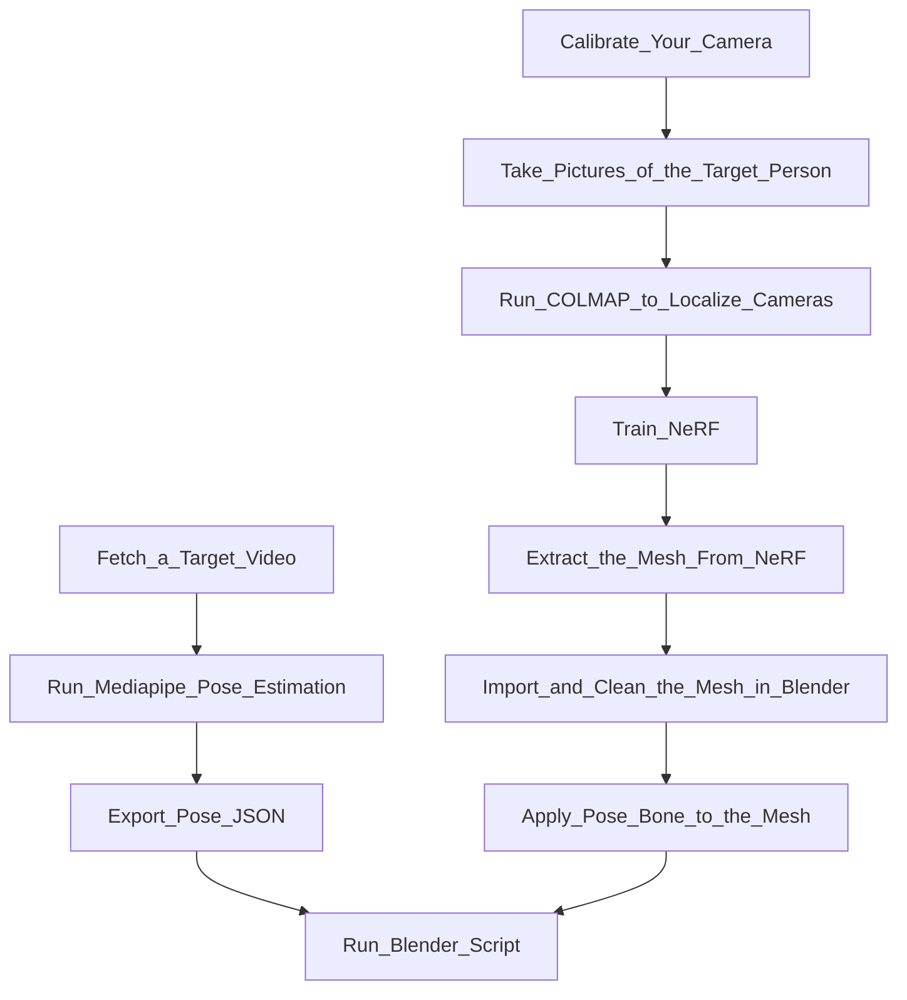
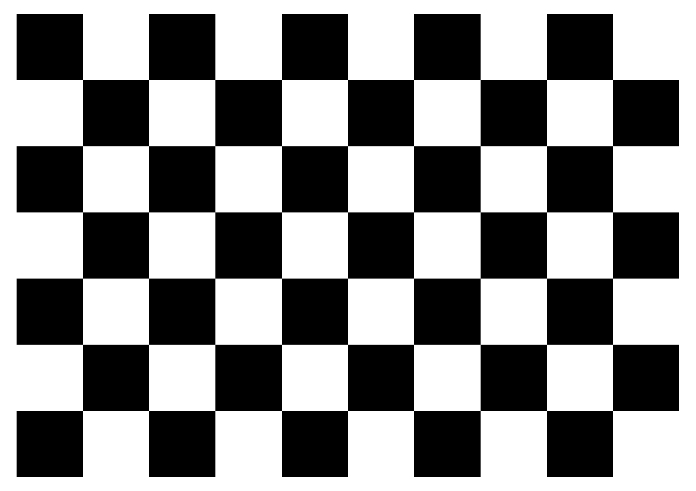
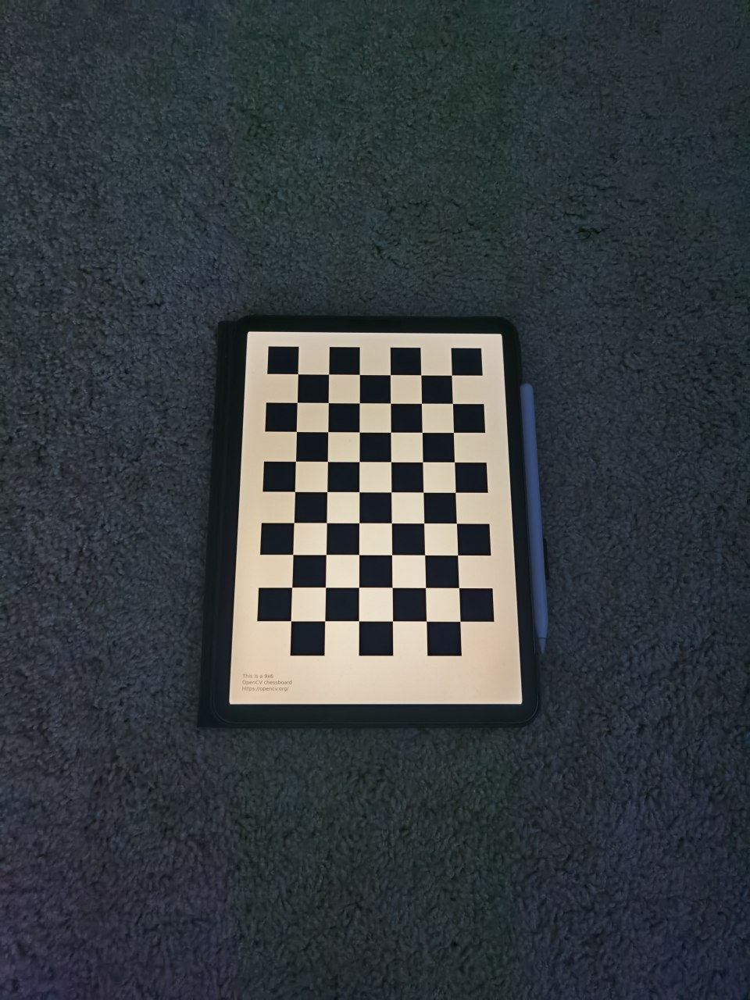
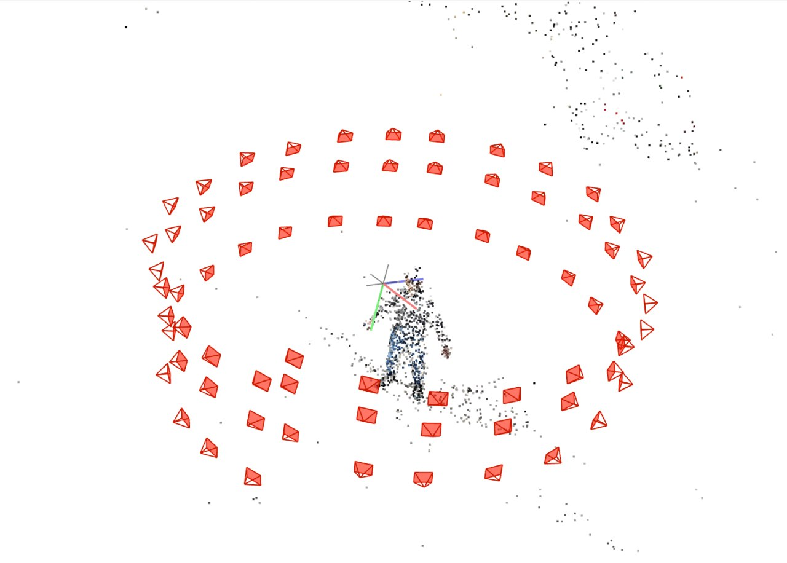

# Digital Twin: An Open-Source Solution

## A Video Demonstration

[](https://www.youtube.com/watch?v=NvI3KYCf9A0)
<figcaption align = "center">
  <b> Click the above image to watch the video </b>
</figcaption>

## Introduction

This repository serves as an example to build your digital twin with only a cellphone camera. The software at every step is either directly using open-source programs or written by me. I'll share the pipeline in depth in the following sections.

## Pipeline



## Prerequisites

- Python 3
  - OpenCV
  - Numpy
  - tqdm
- COLMAP
- nerf_pl
- Blender
- mediapipe

## Step 0 - Camera Localization

The first step of the pipeline is to calibrate your camera. This step is optional, but it would help the scale recovery and improve the localization stability in the COLMAP step. 

To calibrate the camera, please take ~50 images of a checkerboard pattern from different angles. The pattern would be printed out or displayed from any digital screen, eg. an iPad. Place the images under `camera_calibration/calibration_images`.

<p align="center">
    
</p>

<figcaption align = "center">
  <b> Fig.1 - A 9x6 checkerboard pattern </b>
</figcaption>

<p align="center">
    
</p>

<figcaption align = "center">
  <b> Fig.2 - A sample calibration image </b>
</figcaption>


### Procedure
- Take ~50 images of a checkerboard pattern, and place those images under `image_preprocessing/calibration_images`
- Change line 8 (`CHECKERBOARD = (6,9)`) of `image_preprocessing/camera_calibration.py` if necessary
- `cd image_preprocessing`
- Run `python camera_calibration.py`
- Take 50 to 100 images of the target person with the same camera, and place those images under `image_preprocessing/data_orig/FOLDER_NAME`
  - Replace `FOLDER_NAME`
- Change line 20 (`w_h_ratio = 4/3`) of `image_preprocessing/undistort_new_images.py` if necessary
  - `w_h_ratio` is the image width height ratio
- Assign `w_new` and `h_new` at line 21 and 22 of `image_preprocessing/undistort_new_images.py`
  - Do this if the original image resolution is too high
  - This setting will affect both COLMAP and NeRF
- Change lines 46 and 102 of `image_preprocessing/undistort_new_images.py` if there're no less than 10000 images
- Run `python undistort_new_images.py`
  - `image_preprocessing/data/FOLDER_NAME` will be created, under which undistorted images and a `camera.txt` will be stored.

### Tips

- Keep camera scale and orientation fixed
- Keep the body of the target person as static as possible
- Take more than 70 images of the target person with full 360-degree views in an indoor environment
  - Eg. take images from at least 20 uniformly distributed angles and 3 images from each angle at different camera heights
  - An example is shown in Figure 3.
- Separate arms from the main body and legs from each other to reduce manual work in Blender
- If possible, make the background as simple as possible


<p align="center">
    
</p>

<figcaption align = "center">
  <b> Fig.3 - How cameras should be placed </b>
</figcaption>

### Further Comments:

- The photograph step is not automated at all, and it takes a couple of minutes. During that, there could be some minor body shifts, affecting the final mesh quality. In the future, I'm considering using a programmable cheap drone to automatically take pictures, but that extra hardware could cost at least $100. 
- Taking a quick video is another option. I haven't tried that yet.
- My pictures were taken outdoors, and I think that was a mistake and added tons of difficulties for NeRF to converge. That's why I'm suggesting having an indoor photography environment.
- Some AI algorithms could generate masks for the human body, and those masks could be used by NeRF, but I'm not sure if that would work well robustly. 

## Step 1 - Camera Localization

- Move `image_preprocessing/data_orig/FOLDER_NAME` to `1_camera_localization/`
- Create a subfolder `images` under `1_camera_localization/FOLDER_NAME`, and move all images into `1_camera_localization/FOLDER_NAME/images`
- Create a chain of subfolders `sparse/0` under `1_camera_localization/FOLDER_NAME`
- Copy `1_camera_localization/sample_data_subfolder/sparse/0/project.ini` to `1_camera_localization/FOLDER_NAME/sparse/0/project.ini`
  - Remember to change lines 4 and 5 of `project.ini` accordingly
    ```
    database_path=WORKSPACE_ABSOLUTE_PATH/1_camera_localization/FOLDER_NAME/database.db
    image_path=WORKSPACE_ABSOLUTE_PATH/1_camera_localization/images
    ```
  - And also line 14. The four values are `fx`, `fy`, `cx`, `cy`, i.e. `camera_matrix[0,0]`, `camera_matrix[1,1]`, `camera_matrix[0,2]`, `camera_matrix[1,2]`.
    ```
    camera_params=771.0800010279605,772.711181640625,241.53466279090742,354.9183215136509
    ```
- Run COLMAP GUI via `colmap gui`
  - Click `File -> Open project` and select `1_camera_localization/FOLDER_NAME/sparse/0/project.ini`
  - Click `File -> Edit project`
    - Click `New` at the line of Database, navigate to `1_camera_localization/FOLDER_NAME`, and create a file `database.db`
    - Click `Select` at the line of `Images`, and select `1_camera_localization/FOLDER_NAME/images`
    - Click `Save`
  - Click `Processing -> Feature extraction`
    - Make sure that
      - The camera model is `PINHOLE`
      - `Shared for all images` and `Shared per sub-folder` are selected
      - `Parameters from EXIF` is unchecked
      - Values under `Custom parameters` is correct
    - Click `Extract`
  - Click `Processing -> Feature matching -> Run`
  - Click `Reconstruction -> Automatic reconstruction`
    - Assign `Workspace folder` to be `1_camera_localization/FOLDER_NAME`
    - Assign `image folder` to be `1_camera_localization/FOLDER_NAME/images`
    - (Optional) Select `Extreme` for `Quality`
    - Check `Shared intrinsics` and `Sparse model`
    - Uncheck `Dense model`
    - Click `Run`
  - Sparse reconstruction result should be visualized, and please verify the camera poses visually
  - Quit COLMAP
- Change `scene_folder` at line 5 of `1_camera_localization/run_gen_poses.py` to `FOLDER_NAME`
- `cd 1_camera_localization` and `python run_gen_poses.py`

## Step 2 - NeRF Training

- `cd 2_NeRF_training`
- `git clone https://github.com/kwea123/nerf_pl.git`
- `cd nerf_pl`
- Execute the following command to train NeRF
  ```
  python train.py --dataset_name llff \
   --root_dir ../../1_camera_localization/FOLDER_NAME \
   --N_samples 512 \
   --N_importance 128 --img_wh 480 720 \
   --num_epochs 2 --batch_size 1024 \
   --optimizer adam --lr 5e-4 \
   --lr_scheduler steplr --decay_step 10 20 --decay_gamma 0.5 \
   --exp_name exp \
   --spheric \
   --use_disp
   ```
    - Remember to change `--img_wh 480 720` to be `--img_wh ${w_new} ${h_new}`. Replace ${w_new} and ${h_new} with their actual values.
    - Fine-tune `N_samples`, `N_importance`, `num_epochs`, and `batch_size` according to your GPU memory. The above example roughly consumes all GPU memory of an NVIDIA T4 GPU and takes about 1 day to converge at about 1.3 epochs.
- Use `https://github.com/kwea123/nerf_pl/blob/master/extract_mesh.ipynb` to extract a mesh within a certain 3D bounding box.
  - Note: I modified nerf_pl's `extract_color_mesh.py` slightly to reduce memory usage, and the modified file is under `2_NeRF_training`. Besides, I figured out that the 3D bounding box has to be a cube, rather than a cuboid. I also attempted to relieve that constraint but didn't succeed.

### Further Comments:

- Free free to try a faster version of NeRF, eg. `Instant-NGP`.
- We need a better meshing policy specially designed for NeRF or its variant to improve mesh quality and mesh exporting speed, as well as reduce the memory footprint. The current extraction method is indeed a brute-force one.

## Step 3 - Preprocess Mesh in Blender

- Open Blender
- `File -> Import -> Stanford (.ply)` to read the ply file generated in step 2
- Move the mesh bottom center to the origin. Rotate and scale the mesh properly if necessary
- Select the mesh, and in `Material Properties`, select `Base Color` to be `Vertex Color | Color` to see a colorful mesh
- At `Modifier Properties, add two modifier
  - `Smooth`, `Factor' = 1.000, and `Repeat` = 60 
  - `Decimate -> Collapse`, `Ratio' = 0.025
- Export the modified mesh to a new ply file
- Save and Create a new blender project
- Import the modified mesh
- Create a proper armature and parent the mesh to the armature
  - Take a look at the example at `3_preprocess_mesh_in_blender/Yukun512_7.blend`
- Assign weights to each pose bone in the armature
  - Still, please refer to `3_preprocess_mesh_in_blender/Yukun512_7.blend`


### Further Comments:

- Before smoothing, the mesh from the marching cubes has an unrealistically rough surface. Probably a better NeRF variant, eg. Neus, would provide a mesh with higher quality. And `Decimate` speeds up the subsequent processes.
- Blender is an amazingly capable 3D software. I still feel that I only know a little about it. Besides, it's a little bit hard to describe its usage with words, so many substeps are documented concisely here. 

## Step 4 - Mocap and Export

- Fetch your target video, extract images from each frame, and store them under `4_mocap_and_export/images`
- `cd 4_mocap_and_export` and `python mocap.py`
- `blender_data.json` will be generated

### Further Comments:
- There're some AI mocap websites, and I've tried two of them. The first one charged me $48 for a 5min video, and the exported motion was smooth but missed lots of gestures. And the second one was free, but I failed to use it. 
- Those websites could take 20min to process a 5min video, while mediapipe runs at 6~7 FPS. More importantly, with mediapipe, we could build real-time applications, rather than offline animations. 


## Step 5 - Mocap Data in Blender

- In `5_mocap_data_in_blender/script.py`, change the POSE_JSON_FILE_PATH to `$ABSOLUTE_WORKSPACE_PATH/4_mocap_and_export/blender_data.json`

```
POSE_JSON_FILE_PATH = NONE
POSE_OFFSET = 300
```
- Smooth the keyframes by switching the `Editor Type` to `Graph Editor`, andthen execute `key -> smooth key` twice.

### Further Comments:

- There're a lot of comments in the `script.py`. Please read them if you are willing to understand more about the "ugly" trade-offs and tricks in the code.
- There could be plenty of ways to improve the `script.py`, and in the demonstration video, you may notice some spurious behaviors, eg. sudden large body rotations. 
